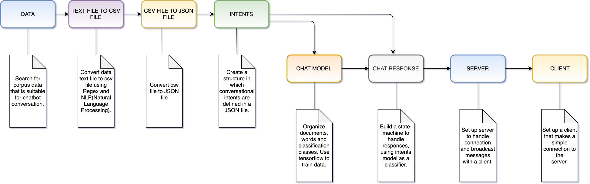
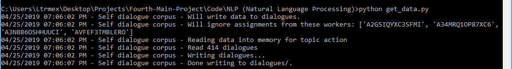
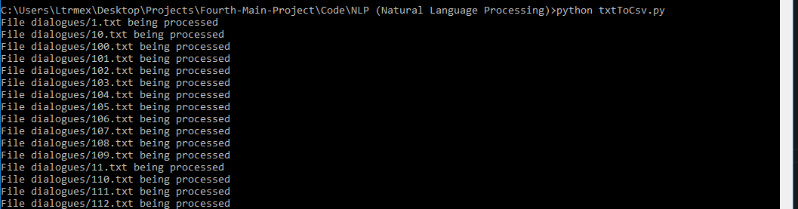
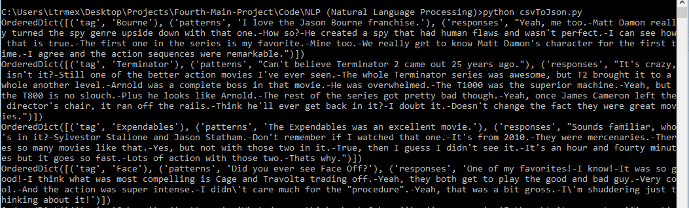
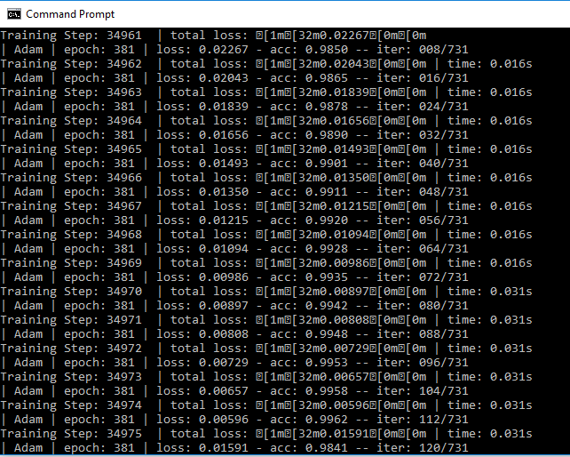
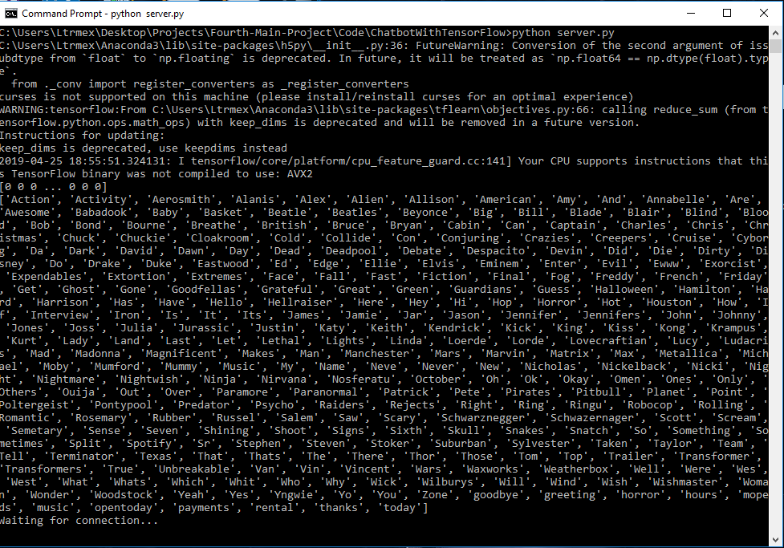
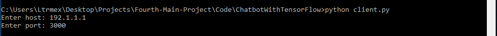
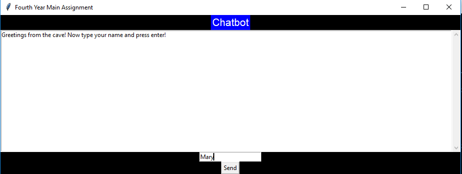
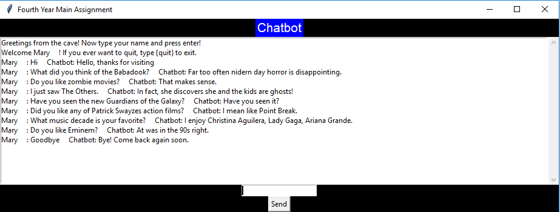

<h1 align="center">A Natural Language Processing Framework for Training a Neural Network Chatbot</h1> 

## Table of Contents  
[1. Project Overview](#Overview) 
[2. Project Structure](#Structure) 
[3. Required to Run](#Required) 
[4. How to Run](#Run) 
[5. Example Output](#Output) 
[6. Natural Language Processing](#Processing) 
[7.TensorFlow](#TensorFlow) 
[8. Neural Networks](#Networks) 
[9. Technologies](#Technologies) 
[10. References](#References) 

<h2 align="center">About Project</h2>

<a name="Overview"/>

### Project Overview

The general context behind our project was to develop chatbot which could be trained on a given data set. Our first approach was to use <strong>Google AIY Kit</strong> and modify it to our needs, however while setting it up and experimenting with it we found out we could not achieve that. There were predefined programs ready for our use, which would mean it would not require much coding from us. Another issue with that approach were the dependencies and documentation that were not reliable.

 

With that in mind we have decided that the best option for us would be to start from the beginning and develop our own chatbot from scratch. The chatbot we came up with, is using <strong>tensorflow</strong> to train data on a given model classification and then build upon that to handle responses once given input from the user. Further we added <strong>client-server</strong> side so that all the necessary response data could be stored on the <strong>server</strong> side, while <strong>client</strong> took care of interaction between user and the chatbot through the use of GUI (Graphical User Interface) which was coded up using <strong>TkInter.</strong>

<a name="Structure"/>

### Project Structure
Simply put the way our project works is as follows:

  

* Data extraction:
  * This mainly happens in 'get_data.py' where depending on input it generates a set of exchanges of conversations between two people on a given topic from corpus data.

  

 
  
* Data conversion:
  * This happens in **txtToCsv.py** and **csvToJson.py**
  * **txtToCsv.py** loops through all the conversations stored in dialogues folder and converts them all into CSV(Comma-Separated Values) format, also called excel format, into a single CSV file.
  

  

 

* **csvToJson.py** converts previously generated CSV file into a JSON(JavaScript Object Notation) format. Main reason for this is that training was set up in a way to accept only JSON file formats.
  

  

 

* Clean up:
  * After successful extraction and conversion of data, next step is to check if the file is correctly set up after which data then can be added to the main data collection which is stored inside **intents.json** file. 
* Training:
  * Training happens in **chat_model.py** using **intents.json** file.
  

  

 

* Response Handler:
  * Response hadnler is responsible to handle responses between user and the chatbot and it's happening in **chat_response.py**.
* Server:
  * On server side is where data, training data, and response handler is stored.
  * Server allows up to five connections at the same time, and **server.py** file is responsible for those actions.
  * Server is connected up with response handler, as it handles user requests.
  

  

   
  
* Client:
  * Client is responsible for interaction between user and the chatbot. It is where data is displayed visually through the use of GUI.
  * Client sends requests with a given message over the socket connection, and it receives back a response from a server which is then displayed in the GUI.
  * Logic behind the client and it's GUI can be seen in **client.py** file.
  

  

   

<a name="Required"/>

### Required to Run

* **Make sure Python programming language is installed, download from here:** [Python Anaconda](https://www.anaconda.com/distribution/)
* **Run the following command:** `pip install -r requirements.txt`

<a name="Run"/>

### How to Run

* **Clone repository from command prompt**
  * `git clone https://github.com/Ltrmex/Fourth-Main-Project`
* **Change directory**
  * `cd Fourth-Main-Project/Code/ChatbotWithTensorFlow`
* **Run Server**
  * `python server.py`
* **Run Client**
  * `python client.py`

<a name="Output"/>

### Example Output

  

 

  

  

<h2 align="center">Background on Technologies Researched</h2>

<a name="Processing"/>

### Natural Language Processing

Natural language processing (NLP) is a subfield of computer science, information engineering, and artificial intelligence concerned with the interactions between computers and human (natural) languages, in particular how to program computers to process and analyze large amounts of natural language data.

 

Challenges in natural language processing frequently involve speech recognition, natural language understanding, and natural language generation.

 

Throughout our project we have researched and tested how NLP functions through coding and reading up online resources. We felt like this was huge step in completion of our project as Chatbot should react only to certain words in the sentence, and come up with reasonable answer. There is a set of examples (Code/NLP (Natural Language Processing)) of how natural processing works. That set of examples was completed through the use of Natural Language Toolkit. The Natural Language Toolkit, or more commonly NLTK, is a suite of libraries and programs for symbolic and statistical natural language processing (NLP) for English written in the Python programming language. 

<a name="TensorFlow"/>

### TensorFlow

TensorFlow is a free and open-source software library for dataflow and differentiable programming across a range of tasks. It is a symbolic math library, and is also used for machine learning applications such as neural networks.

 

TensorFlow is an end-to-end open source platform for machine learning. It has a comprehensive, flexible ecosystem of tools, libraries and community resources that lets researchers push the state-of-the-art in ML and developers easily build and deploy ML powered applications.

 

In our project we have used TensorFlow to create and train our model (<strong>chat_model.py</strong>). Given <strong>intents.json</strong> file where the data set is stored. TensorFlow takes train and test lists, model and neural network to train and test our data. Which then is used in <strong>chat_response.py</strong>

<a name="Networks"/>

### Neural Networks

Artificial neural networks (ANN) or connectionist systems are computing systems vaguely inspired by the biological neural networks that constitute animal brains. The neural network itself is not an algorithm, but rather a framework for many different machine learning algorithms to work together and process complex data inputs. Such systems "learn" to perform tasks by considering examples, generally without being programmed with any task-specific rules.

 

For example, after our chatbot model has been trained it will answer to any relating topic it was trained on, even if the question is not fully parsed, e.g. if user were to input 'What did you think of The Babadook?' it would come up with one of the responses it was trained on, the same would happen if one would simply input 'Babadook'. Even though the word 'Babadook' is not defined on it's own in the data set by using and training the neural network it would still make the connection to the given word.

<a name="Technologies"/>
<h2 align="center">Technologies</h2>

JSON                       |  CSV                      |  LaTex               
:-------------------------:|:-------------------------:|:-------------------------:
  |        | 

Visual Studio Code         |  Python                     |  TkInter              
:-------------------------:|:-------------------------:|:-------------------------:
  |        | 

TensorFlow                 |Natural Language Processing| Google Cloud               
:-------------------------:|:-------------------------:|:-------------------------:
  |        | 

SQLite                     |  MySQL                    | Google Voice Kit               
:-------------------------:|:-------------------------:|:-------------------------:
  |        | 

<a name="References"/>
<h2 align="center">References</h2>

### Natural Language Processing:
* [Wikipedia](https://en.wikipedia.org/wiki/Natural_language_processing)
* [Simple Introduction](https://becominghuman.ai/a-simple-introduction-to-natural-language-processing-ea66a1747b32)
* [Why it Matters?](https://www.sas.com/en_ie/insights/analytics/what-is-natural-language-processing-nlp.html)
* [Python Code Example](https://www.youtube.com/watch?list=PLQVvvaa0QuDf2JswnfiGkliBInZnIC4HL&v=FLZvOKSCkxY)
### TensorFlow:
* [Wikipedia](https://en.wikipedia.org/wiki/TensorFlow)
* [Main Website](https://www.tensorflow.org/)
* [Python Code Example](https://www.youtube.com/watch?list=PLQVvvaa0QuDfKTOs3Keq_kaG2P55YRn5v&v=dFARw8Pm0Gk)
### Neural Networks:
* [Wikipedia](https://en.wikipedia.org/wiki/Artificial_neural_network)
* [Machine Learning with Python and Numpy](https://www.python-course.eu/neural_networks_with_python_numpy.php)
* [Beginner's Guide](https://skymind.ai/wiki/neural-network)
* [Python Code Example](https://www.youtube.com/watch?v=kft1AJ9WVDk)
### Coding References:
* [Client-Server](https://www.youtube.com/watch?v=WrtebUkUssc)
* [Data Extraction](https://github.com/jfainberg/self_dialogue_corpus)
* [TkInter](https://python-textbok.readthedocs.io/en/1.0/Introduction_to_GUI_Programming.html)
* [GuiZero](https://lawsie.github.io/guizero/)
* [Text to CSV Format](https://stackoverflow.com/questions/39642082/convert-txt-to-csv-python-script)
* [CSV to JSON Format](https://stackoverflow.com/questions/19697846/how-to-convert-csv-file-to-multiline-json)
* [Chatbot Example](https://blog.kovalevskyi.com/rnn-based-chatbot-for-6-hours-b847d2d92c43)
* [Neural Network Example](https://youtu.be/FLZvOKSCkxY)
* [Image Recognition Example](https://www.youtube.com/watch?list=PLQVvvaa0QuDffXBfcH9ZJuvctJV3OtB8A&v=hbL_FTEZSyY)

